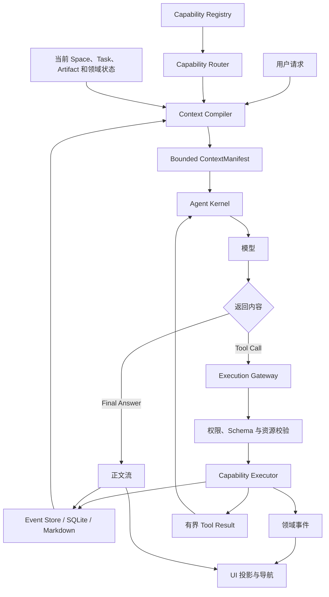

# 轻量 Agent Kernel 与能力运行时

> 代码源头：`packages/ai/src/server/task-agent.ts`、`packages/ai/src/server/agent-runtime.ts`、
> `packages/ai/src/routing/run-policy.ts`、`packages/ai/src/server/context-budget.ts`、
> `packages/ai/src/server/skill-instructions.ts`、`packages/skills/src/index.ts`、
> `apps/desktop/src/main/index.ts`、`apps/desktop/src/main/content-library-service.ts`、
> `apps/desktop/src/main/mcp-service.ts`、`packages/database/task-run-repository.ts`
>
> 状态：部分实现。统一 `ToolLoopAgent`、逐轮 RunPolicy、Skill 正文按需加载、动态工具装配、
> ContextManifest 预算估算、运行事件持久化、主进程权限边界和领域工具已经存在；统一能力注册表、
> Context Compiler、能力发现工具、Skill 附属资源路由、受控脚本执行和跨资源原子领域命令仍在规划。

## 地位

本文定义 Tessera Agent 架构的长期收敛方向：保留一个接近 Pi 的轻量 Agent Kernel，同时把研究、写作、
工作区、内容库、MCP、权限、恢复、UI 导航和未来脚本执行放在 Kernel 外的能力运行时中。

“轻量”只描述模型循环及其上下文，不代表删除产品能力、审计、安全或恢复机制。Tessera 需要同时满足：

1. 核心循环容易理解、测试和替换。
2. 能力数量增长时，模型上下文不随之线性增长。
3. 权限、事务和 UI 一致性不依赖模型记住提示词约定。
4. 完整历史可以恢复，但每次模型调用只读取与当前决策相关的投影。

本文不替代[统一创作 Agent 与内容存储探索](unified-creation-agent.md)、
[Skill 系统](skill-system.md)或[任务会话与导航](task-navigation.md)，而是规定它们如何连接到同一个最小运行核心。

## 问题

Agent 的功能常被错误地等同于系统提示词长度：为了让模型会研究、写作、创建项目、操作文档和调用 MCP，
把所有工作流、工具 Schema、权限说明、历史消息和资源正文一次性放进 prompt。这样虽然“什么都有”，但会产生：

- 简单问答也携带无关 Skill、工具和领域规则。
- 新增一个能力就永久增加每轮上下文和维护耦合。
- 领域不变量依赖模型按正确顺序调用多个工具，失败后容易留下半完成状态。
- 完整工具输出反复进入后续步骤，挤压真正需要的会话与材料。
- UI、数据库与文件状态被迫跟随模型动作猜测，而不是消费可信的领域事件。

反方向直接删除 RunPolicy、持久化、权限和领域服务也不可取。那只会让 Kernel 看起来更小，却失去 Tessera
需要的可靠写入、后台恢复、跨 Space 导航、研究证据链和可审计操作。

需要解决的不是“能力太多”，而是“能力、上下文和 Agent Kernel 没有充分分层”。

## 核心原则

### 能力不等于上下文

能力可以安装、注册并可执行，而不必永久出现在模型输入中。模型只需要看到本轮可选择的少量接口；实现代码、
权限校验、存储适配和 UI 行为留在宿主运行时。

### 持久化不等于提示词

SQLite、Markdown 和运行事件保存完整事实。Context Compiler 根据本轮目标，从事实源生成有界投影；不能因为数据
已经持久化，就把它全部重放给模型。

### 模型负责意图，宿主负责不变量

模型适合判断“是否需要研究”“是否要建立项目”“交付物应该是什么”。宿主负责保证路径、权限、事务、任务归属、
文档移动和 UI 导航的一致性。任何必须按固定顺序完成、失败后需要补偿的动作，都应优先成为领域命令，而不是长提示词。

### 渐进加载优先于全量注册

Skill、工具、MCP 和资源采用元数据、执行契约、附属资源三级加载。未选中的能力正文与 Schema 不进入本轮模型输入。

### 一个循环，多种能力

普通问答、研究、写作和项目整理继续共用一个 Agent loop。差异来自本轮 ContextManifest、开放的 Capability Pack
和领域状态，不创建平行的 Chat、Agent、Research Agent 产品模式。

### 安全与恢复在循环之外

审批、超时、输出上限、路径校验、事件账本和恢复协议是宿主能力，不能只作为 instructions 告诉模型“请遵守”。

## 目标架构



目标依赖方向为：

```text
产品入口
  -> Context Compiler / Capability Router
  -> Agent Kernel
  -> Execution Gateway
  -> 领域服务与适配器

领域服务、数据库、Electron 和 UI 不反向进入 Agent Kernel。
```

## Agent Kernel

Agent Kernel 只保留模型循环所必需的状态和事件：

```ts
async function runAgent(taskId: string) {
  while (true) {
    const context = await contextCompiler.compile(taskId)
    const capabilities = await capabilityRouter.select(context)

    const response = await model.stream({
      instructions: context.instructions,
      messages: context.messages,
      tools: capabilities.tools,
    })

    await eventStore.append(response.events)

    if (response.toolCalls.length === 0) return response.text

    const results = await executionGateway.execute(response.toolCalls, context.authorization)
    await eventStore.append(results)
  }
}
```

当前 `packages/ai/src/server/task-agent.ts` 和 `agent-runtime.ts` 已由 AI SDK `ToolLoopAgent` 承担循环、流、工具调用、
停止条件和生命周期。目标不是重写一套 while loop，而是继续削减进入它的产品特例：

- `task-agent.ts` 只组合模型步骤、停止条件、ContextManifest 和本轮 Capability Pack。
- `agent-runtime.ts` 只负责一次 run 的输入转换、公开流转换与结果收口。
- 研究、内容库、MCP、UI 和持久化实现继续由 Kernel 外部注入。
- 不能为了代码行数更少而绕过 AI SDK 已有的工具、审批、类型和流协议。

## Capability Registry

Capability Registry 是宿主持有的能力目录。一个能力可以是 Tool、Skill、领域命令、MCP 工具或受控脚本入口，
但使用统一的最小描述符：

```ts
type CapabilityDescriptor = {
  id: string
  kind: "tool" | "skill" | "workflow" | "mcp" | "script"
  summary: string
  triggers: string[]
  requiredPermissions: string[]
  resourceKinds: string[]
  load: () => Promise<LoadedCapability>
}
```

描述符只服务发现、解释和策略，不自动授予权限。`load()` 返回的完整 instructions、工具 Schema 或资源路由只在
能力被选中后进入运行准备阶段。

当前能力分散在 RunPolicy、内置 Skill 注册表、内容领域工具、研究工具、工作区工具和 MCP 服务中。第一阶段不要求
把实现搬到一个新包，而是先建立统一描述符和快照，让 Context Compiler 不必理解每个来源的内部结构。

## Capability Pack 与路由

工具不按“当前安装了什么”全量暴露，而按本轮目标组成 Capability Pack：

```ts
const packs = {
  conversation: ["request-user-input"],
  research: ["web-search", "read-web-source", "record-evidence", "finalize-research"],
  workspaceRead: ["list-files", "read-file", "search-files"],
  workspaceWrite: ["create-file", "update-file"],
  content: ["create-project", "create-document", "move-documents"],
}
```

选择优先级为：

1. 用户显式选择的创作方式或 Skill。
2. 当前领域状态要求的下一组合法动作，例如研究计划门禁。
3. RunPolicy 对明确意图、当前资源和模型能力的确定性路由。
4. 注册表检索返回的少量候选。
5. 一个有界 `discover-capabilities` 兜底工具，允许模型在路由遗漏时请求最多若干候选。

不允许把所有 MCP 工具、用户 Skill 和未来脚本入口的完整 Schema 常驻模型上下文。能力规模增长时，本轮工具数量
应由任务复杂度决定，而不是由安装总量决定。

## Context Compiler

Context Compiler 是事实源与模型调用之间的查询层。它读取完整状态，但只生成当前步骤需要的输入：

```ts
type CompiledContext = {
  instructions: string
  messages: ModelMessage[]
  resourceRefs: ResourceRef[]
  activeCapabilityIds: string[]
  authorization: AuthorizationSnapshot
  manifest: ContextManifest
}
```

### 输入

- 基础系统约束。
- 最近对话和必要的历史摘要。
- 当前 run 选中的一个主 Skill。
- 当前步骤开放的工具 Schema。
- 当前文档、附件、Artifact 和项目的稳定引用。
- 与本轮问题直接相关的证据片段或工具结果。
- 未完成的审批、结构化提问和领域状态。
- 模型上下文与输出上限。

### 编译顺序

1. 固定安全约束和当前用户请求。
2. 当前步骤必须使用的工具、领域状态和审批信息。
3. 最近对话与当前文档。
4. 被选中的 Skill instructions。
5. 检索得到的历史摘要、证据和工具结果。
6. 仍有预算时才加入次要背景。

超过预算时先压缩或移除低优先级材料，不能静默截断工具调用配对、引用证据或权限信息。ContextManifest 记录每类
输入的估算和裁剪原因，不保存正文，也不伪装成供应商实际 Token 账单。

当前 `context-budget.ts` 已在每个模型步骤前估算 instructions、消息、工具结果、工具定义和 framing，并阻止明确超限。
后续需要把“估算与拒绝”提升为“查询、排序、摘要和裁剪”的统一 Context Compiler。

## Skill 与附属资源

Skill 采用三级渐进加载：

| 层级 | 常驻内容 | 加载时机 | 当前状态 |
| --- | --- | --- | --- |
| L0 目录 | ID、名称、简述、来源和声明需求 | 应用启动、选择器和路由 | 已实现基础能力 |
| L1 工作流 | 选中 Skill 的 `SKILL.md` instructions | 每个 run 开始 | 已实现 |
| L2 资源 | `references/`、`assets/`、`scripts/` 和模板 | Skill 明确引用且当前步骤需要 | 规划 |

L2 资源不得整目录进入 prompt。文本参考通过受限资源读取器按需返回片段；资产以稳定引用传递；脚本通过独立执行工具
运行，只把有界 stdout、stderr、退出状态和产物引用返回模型。

受控脚本执行至少需要：

- 入口必须位于当前已选 Skill 的托管 `scripts/` 目录。
- 禁止绝对路径、`..`、符号链接逃逸和任意 Shell 字符串拼接。
- Python、Bash 和 TypeScript 都按任意代码执行处理，不因扩展名降低安全等级。
- 使用固定 Runtime、只读 Skill 目录、临时输出目录、环境变量白名单、超时和输出上限。
- 网络和工作区写入默认关闭，按声明、用户授权和本轮审批单独开放。
- 第三方 Skill 首次执行代码时显示来源、入口和权限确认。

## Execution Gateway

Execution Gateway 是所有模型副作用的共同入口：

```text
Tool Call
  -> 找到本轮已开放能力
  -> Schema 校验
  -> 权限与资源范围校验
  -> 必要时请求用户批准
  -> 执行领域服务、MCP 或脚本
  -> 记录审计和领域事件
  -> 返回有界公开结果
```

Gateway 不接受模型提供的绝对路径、数据库标识、环境变量或任意可执行命令。工具失败使用稳定公开错误，原始供应商
载荷、堆栈、密钥和不受限输出不进入 renderer 或后续模型上下文。

当前主进程已经分别实现工作区路径保护、内容领域服务、MCP 信任与逐次批准、研究 Reader 和运行错误脱敏。目标是
让这些边界共享能力描述、授权快照和结果裁剪协议，而不是合并成一个拥有全部权限的万能工具。

## 领域命令

多个必须共同成功的动作需要封装成领域命令。模型只表达意图和参数，领域服务保证事务与补偿。

例如“创建新 Space，把当前对话和文档迁入，并切换 UI”不应由模型松散调用三个工具：

```ts
type CreateProjectAndRelocateTaskInput = {
  taskId: string
  projectName: string
  documentIds: string[]
}

async function createProjectAndRelocateTask(input: CreateProjectAndRelocateTaskInput) {
  const project = await createProject(input.projectName)
  await relocateTask(input.taskId, project.id)
  await moveDocuments(input.documentIds, project.id)

  await eventStore.append({
    type: "task-placement-changed",
    taskId: input.taskId,
    workspaceId: project.id,
  })

  return { project, taskId: input.taskId }
}
```

renderer 消费 `task-placement-changed` 后读取权威任务快照、打开目标 Space 并保持原 Task。提示词无需描述 UI 跳转顺序，
Agent Kernel 也不需要理解 Electron 导航。

当前 `create-project`、`move-documents`、任务工作区仓储更新和跨 Space 打开逻辑分别存在，但还没有形成这一原子协议；
这是领域命令层“部分实现”的直接案例。

## Event Store 与 UI 投影

Agent 运行产生两类事件：

1. 模型事件：正文、reasoning、Tool Part、审批、完成和失败。
2. 领域事件：Artifact 创建、项目迁移、任务归属变化、文档冲突和权限决定。

两类事件都可以持久化和恢复，但只有与下一步模型决策相关的有界投影进入 Context Compiler。UI 订阅公开事件并读取
权威快照，不能从模型正文猜测某个项目是否创建成功或是否应该导航。

当前 `task_runs` 与 `task_run_events` 已保存模型运行账本，任务消息和 Artifact 可以恢复；领域事件仍主要分散在资源关系、
Operation 表和 renderer 主动查询中。后续先定义少量跨界面必要事件，不建立无边界的通用事件总线。

## 典型流程

### 普通问答

```text
用户问题
  -> Router 选择 conversation Pack
  -> 不加载 Skill，不注册工作区写入或内容库工具
  -> 模型直接回答
```

能力总量增加不能让这条路径的工具 Schema 或 prompt 继续增长。

### 深入研究

```text
用户要求深入研究
  -> RunPolicy 选择 research Skill
  -> 加载 research/SKILL.md
  -> 领域状态只开放计划工具
  -> 计划完成后开放搜索、阅读和证据工具
  -> 工具正文留在运行时，Context Compiler 选择相关证据片段
  -> 完成门槛满足后关闭研究工具并生成报告
```

研究状态机和证据合法性由宿主执行，Skill 只描述方法与交付标准。

### 创建项目并迁移当前任务

```text
用户明确要求建立项目
  -> Router 开放一个领域命令
  -> 模型提交名称和目标文档
  -> 用户批准
  -> 主进程创建项目、更新任务作用域、移动文档并记录事件
  -> renderer 打开目标 Space 和原 Task
  -> 下一轮 Context Compiler 读取新的当前作用域
```

## 与 Pi 的关系

Pi 最值得吸收的是显式、集中、可读的 Agent loop，以及 AgentMessage、工具结果和事件流的直接关系。Tessera 不应照搬
Pi coding agent 的默认 Shell 权限、终端宿主或会话实现，也不应为了形式上的轻量删除产品边界。

目标组合是：

```text
Pi 风格的轻量 Kernel
+ Tessera 的类型化能力注册与权限网关
+ 渐进式 Skill / Tool / Resource 加载
+ 有界 Context Compiler
+ 可恢复事件账本和领域命令
```

判断一个机制是否应该进入 Kernel，可以使用以下问题：

- 每一种 Agent 任务都必须理解它吗？
- 删除 Electron、SQLite 或具体领域后，它仍然成立吗？
- 它属于模型循环，还是属于权限、存储、产品状态或展示？

只有前两项为“是”且最后一项属于模型循环时，才应进入 Kernel。

## 实施顺序

### 第一阶段：能力快照

- 为现有 Skill、研究、工作区、内容库和 MCP 能力生成统一只读描述符。
- RunPolicy 输出 Capability Pack ID，而不是由多个入口重复判断工具集合。
- 在运行解释中记录候选、选中和拒绝的能力 ID，不保存 Schema 或正文。

### 第二阶段：Context Compiler

- 把当前分散的 instructions、消息、工具结果、资源和预算组装集中到一个纯编译边界。
- 为每类输入定义优先级、上限、摘要和不可截断规则。
- 使用现有 ContextManifest 验证编译结果并补充裁剪原因。

### 第三阶段：领域命令

- 优先收敛“创建项目并迁移任务”“创建 Artifact 并打开协作视图”等跨数据库、文件和 UI 的流程。
- 领域命令返回稳定对象和领域事件，不返回实现路径或让模型编排 UI。
- 为部分失败建立事务或显式补偿测试。

### 第四阶段：Skill L2 资源

- 增加受限 reference / asset 读取协议。
- 设计脚本 manifest、Runtime 选择、沙箱、授权和产物协议。
- 在没有稳定隔离与审批前，不开放通用 Shell。

### 第五阶段：删除重复上下文

- 移除已经由领域状态、Schema 或权限网关保证的提示词规则。
- 未被选中的能力不进入 ContextManifest。
- 用真实任务集验证精简前后工具选择、引用正确率、写入安全和恢复行为。

## 验收标准

1. 普通问答不加载 Skill、工作区写入、内容库或 MCP Schema。
2. 安装能力数量增长时，普通问答上下文保持近似稳定，不随注册表总量线性增长。
3. 新增一个独立能力不需要修改 Agent Kernel，只新增描述符、执行器和必要的领域投影。
4. 每个模型步骤都能解释实际加载的 Skill、工具、资源类别和预算，但不暴露正文或秘密。
5. 完整任务可以从事件和事实源恢复，恢复不要求把完整运行账本重放进模型。
6. 权限、路径、审批和事务即使模型忽略 instructions 仍然成立。
7. 创建项目并迁移任务后，数据库归属、Artifact、当前 Space 和 UI 中的原 Task 保持一致。
8. Skill 脚本未获批准、越界、超时或输出超限时安全失败，不污染工作区或后续上下文。

## 非目标

- 不为了轻量重新实现 AI SDK 已经提供的 ToolLoop、流和审批协议。
- 不把 Capability Router 变成另一个拥有完整对话和全部工具的常驻大模型 Agent。
- 不允许 Skill、MCP 或插件通过描述符自行获得权限。
- 不让 renderer 执行脚本、访问 Node.js 或直接修改任务/工作区归属。
- 不把所有领域事件、数据库记录或工具输出默认加入模型历史。
- 不以代码行数、包数量或 prompt 的绝对最小值替代可靠性和用户能力。
