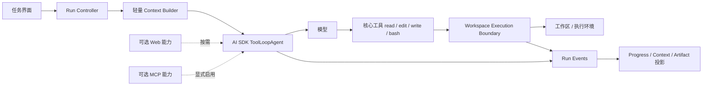

# Pi 参考下的 Agent 减法实施路线图

> 当前实现源头：`packages/ai/src/server/agent-runtime.ts`、`packages/ai/src/server/task-agent.ts`、
> `packages/ai/src/server/web-tools.ts`、`packages/ai/src/server/task-interaction-tools.ts`、
> `packages/agent-runtime/src/workspace-file-capabilities.ts`、
> `apps/desktop/src/main/read-only-agent-tools.ts`、`apps/desktop/src/main/agent-change-service.ts`、
> `apps/desktop/src/main/research-service.ts`、`apps/desktop/src/main/content-library-service.ts`、
> `packages/database/task-run-repository.ts`、`packages/database/research-repository.ts`
>
> 外部研究输入：`docs/research/pi/`、`docs/research/eigent/`
>
> 状态：**一期实施完成，P0–P5 已收口。** 当前新运行已退出
> 工作区逐次写入审批、旧工作区工具、内容库工具和研究阶段状态机；Research/Writing 只保留为方法型 Skill；
> 本文是一期 Agent 减法的当前决策所有者。
>
> 决策日期：2026-09-01

## 1. 文档地位

本文定义 Tessera 下一阶段真正实施的 Agent 减法，不是远期能力愿望清单，也不把现有实现描述成目标架构。

相关文档的责任调整如下：

- [轻量 Agent Kernel 与能力运行时](agent-kernel-and-capability-runtime.md)保留长期分层、Context Compiler 和运行控制研究，
  但不再拥有一期工具数量、领域工作流和审批交互的实施优先级。
- [Agent 本地文件能力：`read/edit/write` 实现事实](agent-file-capabilities.md)描述 P1 已落地的路径保护、精确编辑、版本复核、
  原子写入与旧审批只读兼容边界。
- [研究工作流与证据链](research-workflow.md)继续解释已发布数据、历史运行和当前研究实现；其模型可见多工具状态机
  在本文中被列为待退出主 Agent 的能力，不继续扩张。
- [统一创作 Agent 与内容存储探索](unified-creation-agent.md)继续拥有内容存储实验和已实现产品对象；内容库项目管理不再
  默认作为主 Agent 核心工具。
- Pi 与 Eigent 研究文档是证据档案，不是 Tessera 的实现事实源。

如果其他架构文档与本文对“一期接下来做什么”的描述冲突，以本文为准；已发布数据库迁移、历史消息和当前生产行为
仍以源码及其原文档为准，不能用本文反向解释成已经迁移完成。

## 2. 已确认的产品决定

一期不再继续增加 Agent 能力，而是先把主链减成一个可靠的 Pi 式单 Agent：

1. 保留 AI SDK `ToolLoopAgent`，不重写模型流、Tool Part 和供应商协议。
2. 默认模型可见的本地核心工具最终收敛为 `read`、`edit`、`write`、`bash`。
3. 工作区由用户明确打开后，新运行中的普通文件读取和写入不再逐次请求批准。
4. 路径限制、符号链接防逃逸、版本冲突、同文件串行、原子写入、取消和结果预算保留在执行器中。
5. 研究、内容库、项目管理和审批状态不再各自扩张成主 Agent 的一组核心工具。
6. 系统提示词只表达角色、当前环境和少量跨工具原则；可由代码保证的规则不得继续堆进 Prompt。
7. Agent 稳定性以 Pi 的 turn、工具批次、事件顺序、取消、续轮、重试和压缩语义为主要参考。
8. Eigent 只作为产品反馈层参考：Progress、Execution Context、Artifact 和未来 Browser；一期不建设 Workforce。

“参考 Pi”指采纳其薄 Kernel、少工具和清晰会话语义，不表示复制第三方源码，也不表示照搬其裸宿主权限。
任何源码复用仍需单独核对许可证；本文默认 Tessera 自行实现契约。

### 2.1 证据索引

本文的外部判断来自仓库内固定提交研究，实施时应回到对应专题复核，不依赖聊天结论：

| 决策问题 | Pi 证据 | Eigent 证据 |
| --- | --- | --- |
| Kernel 与工具循环 | [Agent Kernel、循环与工具执行](../research/pi/agent-kernel-loop-and-tool-execution.md) | [Agent 运行时与工具装配](../research/eigent/agent-runtime-and-tool-assembly.md) |
| 会话、重试与压缩 | [AgentSession 产品编排](../research/pi/agent-session-orchestration.md)、[上下文、系统提示词与压缩](../research/pi/context-system-prompt-and-compaction.md) | [上下文、记忆与压缩](../research/eigent/context-memory-and-compaction.md) |
| 文件、Shell 与权限 | [工具、文件、Shell 与安全](../research/pi/tools-files-shell-and-security.md) | [工作区、文件与 Artifact](../research/eigent/workspace-files-and-artifacts.md) |
| 能力装配 | [扩展、Skills 与能力装配](../research/pi/extensions-skills-and-capability-assembly.md) | [MCP 与 Connectors](../research/eigent/mcp-and-connectors.md)、[Skills 系统](../research/eigent/skills-system.md) |
| 多 Agent 与产品反馈 | Pi 不以固定 Workforce 为默认主链 | [工作群与多智能体编排](../research/eigent/workforce-and-multi-agent-orchestration.md)、[UI、进度审查与信息架构](../research/eigent/ui-progress-inspection-and-information-architecture.md) |
| 总体取舍 | [Pi 研究总览](../research/pi/README.md) | [Eigent 研究总览](../research/eigent/README.md) |

Pi 研究固定在 `853a80d26c90a14c1886f0ebb8ffaae133ca2185`（0.84.4），Eigent 研究固定在
`d3089558c6e0021eed58270b49893835b02ec4e9`。`.local/pi*` 与 `.local/eigent` 只用于本机源码复核，受版本控制的研究文档
才是其他 checkout 可读取的证据入口。

## 3. 为什么现在做减法

### 3.1 当前核心已经混入太多产品特例

当前主调用链是：

```text
Electron 主进程
  -> streamAiAgent
  -> agent-runtime.ts 组装所有候选工具、Prompt、历史投影和公开流
  -> task-agent.ts 按 RunPolicy 与研究阶段再次收窄
  -> AI SDK ToolLoopAgent
```

AI SDK 循环本身并不重，重量主要来自循环外围：

- `agent-runtime.ts` 同时知道供应商搜索、内容库、工作区相关性、子 Agent、研究服务、MCP、写入审批、错误恢复和回答后处理；
- `task-agent.ts` 同时知道通用调用参数、工具 scope、研究阶段、ContextManifest 和工具修复；
- 根系统提示词包含工作区、内容库、读取分页、完整写入、审批、拒绝、冲突、委派、Shell 禁止、MCP 和 Artifact 规则；
- 研究闭环依靠一组模型可见工具和运行时阶段强制共同推进；
- 内容对象操作也作为模型工具进入同一个循环。

相关主要生产文件合计已经超过五千行；行数本身不是删除理由，但它说明一次 Agent 行为要同时维护的概念数量已经很高：

| 责任 | 主要文件 | 当前规模（约） |
| --- | --- | ---: |
| 主 Agent 组装与流 | `agent-runtime.ts` | 622 行 |
| ToolLoopAgent 动态策略 | `task-agent.ts` | 412 行 |
| 研究工具适配 | `research-tools.ts` | 327 行 |
| 研究领域服务 | `research-service.ts` | 1,028 行 |
| 内容库服务 | `content-library-service.ts` | 561 行 |
| 工作区读取后端 | `read-only-agent-tools.ts` | 440 行 |
| 写入提案与审批 | `agent-change-service.ts` | 295 行 |

本轮目标不是按行数删除这些文件，而是先减少主 Agent 必须理解和同步的契约。领域服务可以继续服务 UI、历史兼容或后续扩展，
但不应因为已经存在就永久留在模型核心路径。

### 3.2 过多模型工具把确定性流程交给模型

当前工具来自七个来源：

| 来源 | 当前模型可见能力 |
| --- | --- |
| 供应商 | 可选 `web_search` |
| 工作区读取 | `list-workspace-files`、`read-workspace-file`、`search-workspace-text`、`read-current-document` |
| 工作区委派/写入 | `delegate-workspace-research`、`write-workspace-document` |
| 交互 | `request-user-input`、研究计划展示 |
| 研究 | 发布计划、读取网页、登记证据、推荐来源、完成检查 |
| 内容库 | 查询项目/Artifact、创建文档/项目、移动文档 |
| 扩展 | 用户启用的 MCP 工具 |

这些工具并非每轮全部激活，现有 RunPolicy 和研究阶段会收窄它们；但主运行时仍需构造、分类、提示、持久化和测试所有组合。
尤其是发布计划、登记证据、推荐来源和完成检查，本质上是研究产品状态机的命令，不是通用 Agent Kernel 的基础动作。

### 3.3 Prompt 正在替执行器重复规则

当前 `agentInstructions()` 包含十二条规则，其中大量内容已经或应该由代码强制保证：

- 工作区路径和文件类型由主进程验证；
- 写入是否经过批准由 AI SDK 与主进程状态控制；
- 磁盘冲突由 hash 和版本复核判定；
- MCP 是否可执行由配置和审批判定；
- 内容库项目 ID 由服务查询和校验；
- 研究阶段由 `prepareStep` 决定可见工具。

同时维护 Prompt 规则和执行规则会形成双重事实源。模型可能忘记 Prompt，但执行器不能忘记不变量；因此继续加长 Prompt
不会带来相称的可靠性。

### 3.4 逐次文件审批与产品心智冲突

当前写入链为：模型生成完整候选 → 冻结提案 → UI 展示 Diff → 用户批准 → 新 turn → 版本复核 → 原子写入。
它对防止静默覆盖有效，但也让普通工作区编辑变成高摩擦交易。

一期选择改变交互授权粒度：用户明确打开一个工作区，等价于允许当前前台任务在该工作区内进行普通文件读写；每次
`edit`/`write` 不再重复询问。数据损失防线仍保留为执行器契约，授权变化不等于移除文件边界。

## 4. 三个项目分别提供什么

### 4.1 Pi：Kernel、工具和稳定性参考

Pi 的成熟主链把责任分为 `agentLoop`、`Agent` 和 `AgentSession`：

- `agentLoop` 只处理模型 turn、工具调用、工具结果和下一轮；
- `Agent` 管理运行状态、Abort、steering/follow-up 队列和事件归约；
- `AgentSession` 管理产品会话、资源、压缩、重试、扩展和持久化；
- coding-agent 默认只激活 `read`、`bash`、`edit`、`write`；
- 活跃工具与系统提示词同步，未激活能力不进入当前模型输入。

Tessera 采纳的不是 Pi 的 Node 文件权限，而是以下结构原则：

1. 工具数量少，单个工具能力足够完整；
2. 模型循环不理解领域产品对象；
3. 工具结果提交顺序、并行执行和终止语义显式；
4. 会话控制与模型 turn 分层；
5. Prompt 只说明当前实际能力；
6. 多入口共用一套会话语义。

Tessera 明确不采纳：绝对路径默认可用、cwd 外访问、无沙箱任意 Bash、直接覆盖且不检查外部修改、同进程任意扩展
替代可信权限边界。

### 4.2 Eigent：产品反馈层参考

Eigent 最值得保留的是用户可以看见的长期对象，而不是 CAMEL Workforce。Tessera 只接入已有事实源能够证明的部分：

- Progress：当前事实活动、等待与最终状态；目标步骤必须来自未来显式公开 Plan；
- Execution Context：本轮实际使用的文件、Skill、MCP、模型和 Web hostname；
- Agent Folder / Artifact：执行中产生的文件可预览、打开和审查；
- Plan：复杂任务的公开计划可查看和调整；
- Browser：浏览器会话和页面操作有可见预览；
- Delegation：真正发生委派时可以展开 Worker/Child Run。

这些首先是 Run Event 的产品投影，不要求增加一组模型工具，也不要求创建平行 Agent runtime。

一期明确不复制 Eigent 的显式 Workforce 模式、固定 Worker 池、多进程多事实源、默认全工具、目录轮询推断状态和
folder-backed Space 默认 `direct-write`。

### 4.3 Tessera：保留安静工作的底层保证

Tessera 已有一些比 Pi 和 Eigent 更适合长期桌面内容产品的底座，不应在减法中顺手删除：

- renderer 不直接访问 Node、文件系统和数据库；
- 主进程持有真实工作区根和密钥；
- 相对路径、`realpath` 与符号链接边界；
- 有界分页读取和结构化截断；
- 外部修改检测、同文件队列和原子替换；
- AI SDK 标准 Tool Part 与取消信号；
- SQLite run/event 历史和稳定错误分类；
- Markdown 仍是内容事实源。

目标体验接近 Pi，但这些保证应在底层安静执行，而不是继续扩大 Prompt 和审批 UI。

## 5. 一期目标架构



依赖原则：

```text
产品入口
  -> Run Controller
  -> Context Builder + Tool Registry
  -> AI SDK ToolLoopAgent
  -> Tool Adapter
  -> 主进程执行边界

研究服务、内容库服务、数据库和 renderer 不反向进入 Agent Kernel。
```

`ToolLoopAgent` 继续拥有模型步骤、工具调用和标准流；Tessera 不仿写 Pi 的循环。需要从 Pi 学习的事件、队列和可靠性
语义，通过 AI SDK 生命周期和外层 Run Controller 补齐。

## 6. 核心工具契约

### 6.1 `read`

职责：读取模型完成任务所需的文件内容。

目标行为：

- 只接受当前 run 授权工作区内的路径；
- 支持 offset/limit 和明确的截断续读信息；
- 文本结果有行号和字节/行数预算；
- 文件不存在、目录、二进制和不支持格式返回稳定错误；
- 是否扩展图片读取由模型多模态支持单独决定；
- 文件发现由 `bash` 的 `ls`/`rg`/`find` 完成，不继续为列表和搜索各维护一个核心工具；真实隔离测试通过后，
  过渡列表/搜索工具及其端口、注册和测试已经删除。

当前 `read-workspace-file` 的分页、hash 和截断协议可以复用；`read-current-document` 应由调用方把当前文档路径作为
run 资源提供，不再需要独立模型工具。

### 6.2 `edit`

职责：对已有文本文件执行确定性的局部修改。

目标行为：

- 接受一个路径和一组精确 `oldText → newText` edits；
- 每个 `oldText` 必须唯一匹配，所有 edits 必须互不重叠；
- 同一批 edits 以同一个原始版本计算；
- 写回前在同文件临界区重新读取并检查基准 hash；
- 保留 BOM 与行尾风格；
- 返回有界 Diff 摘要和新版本 hash；
- 普通工作区修改不触发逐次审批；
- 冲突、目标变化或 Abort 时不覆盖磁盘新版本。

Pi 的 `edit` 是行为参考；实现继续复用 Tessera 的路径边界、版本复核和原子提交。

### 6.3 `write`

职责：创建新文件，或在明确版本前提下完整写入已有文件。

目标行为：

- 只接受工作区相对路径和有界正文；
- 创建默认不得覆盖已有目标；
- 更新已有文件必须携带或绑定最近一次读取得到的基准 hash；
- 在同文件队列内复核后原子提交；
- 普通工作区写入不触发逐次审批；
- 返回 created/updated/conflict 和稳定版本信息；
- 目录创建范围、允许扩展名和隐藏路径政策由执行器决定，不由 Prompt 决定。

内容库中的“正式 Artifact”不再要求模型先调用项目查询和创建文档工具。文件写入成功后，应用层可以根据当前工作区、
用户明确交付意图和 Run Event 登记 Artifact；文件内容事实仍在 Markdown。

### 6.4 `bash`

职责：提供 Pi 式通用探索、构建、测试和脚本执行能力。

`bash` 已通过 [Bash ExecutionEnvironment](bash-execution-environment.md) 在 macOS 落地以下边界：

- 明确 cwd 与允许挂载；
- 工作区外文件访问策略；
- 环境变量白名单和 Secret 隔离；
- 命令超时、Abort 后进程树终止和最终 quiescence；
- stdout/stderr 持续 drain 与最终输出预算；
- 网络策略；
- 产物发现与 Run 关联；
- late result 和已取消 run 的提交规则；
- macOS 能力声明，以及 Windows/其他平台未启用的适配边界。

当前只在 macOS Seatbelt 能力探针通过后注册；失败或其他平台不提供一个仅设置 cwd、实际上可以逃逸的 fallback。

### 6.5 可选能力

- Web：保留供应商原生搜索；若稳定研究仍需要深读正文，把搜索和读取合并为一个紧凑的可选 Web capability，
  不恢复五个研究状态工具。
- MCP：只在用户显式启用的 server/tool 范围内注册，不算核心工具；外部副作用授权策略单独评审。
- Skill：继续作为当前任务的方法说明按需加载，不因 Skill 存在而扩大文件、网络或执行权限。
- 用户提问：属于 Run Controller 的暂停/继续协议；可以沿用 AI SDK Tool Part 表达，但不计入本地执行工具数量。

## 7. 授权、审批与审计的新边界

### 7.1 工作区授权

用户通过系统目录选择器打开工作区，主进程成功解析并登记后，新前台 run 获得该工作区内普通读写授权。授权不包含：

- 工作区外路径；
- 符号链接逃逸后的目标；
- 删除和重命名；
- 任意 Shell 的宿主全权限；
- 网络、Secret 或外部 MCP 副作用；
- 后台无人值守运行。

这些能力需要独立的执行政策，不能从“工作区已打开”推导。

### 7.2 退出逐次文件审批

新运行中的 `edit/write` 不再设置 `needsApproval: true`。现有审批数据的处理规则：

- 历史 approval Tool Part 和变更提案继续可读、可渲染；
- 已完成记录不重写；
- 迁移时仍处于 pending 的旧提案不得自动执行，应收口为过期/取消或保留为只读历史；
- 已发布数据库迁移不删除、不改写；
- 删除旧审批执行路径前必须先证明没有新运行调用，并保留历史读取兼容。

不引入长期双运行时或永久 feature flag。每个垂直切片完成后，用 Git diff/commit 作为恢复路径；旧历史兼容与新执行路径
必须分开，不能让兼容代码继续注册旧工具。

### 7.3 保留最小审计账本

审计不作为模型工具，也不作为普通用户每次都必须操作的界面。最小 run ledger 只需要稳定记录：

- run identity、实际模型和能力快照；
- tool call 的名称、状态、时序和有界参数摘要；
- 文件副作用的目标稳定引用、基准版本和提交结果；
- Abort、超时、失败和最终状态；
- Token、步骤和工具耗时等运行指标。

研究证据、来源推荐和内容项目 Operation 可以作为各自领域数据继续存在，但不定义通用 Agent Kernel 的推进状态。

## 8. 系统提示词减法

根系统提示词只保留四类信息：

1. 身份：Tessera 中工作的通用单 Agent；
2. 环境：当前工作目录、平台和真实可用工具；
3. 原则：先读取再修改、工具失败后按结果纠正、回答简洁并清楚引用路径；
4. 当前任务：用户显式选择的单一 Skill 和必要项目指令。

以下内容必须退出根 Prompt：

- 审批 Part 的执行顺序；
- `modifiedAt`/hash 的手工传递教程；
- 研究阶段和完成门槛；
- 内容库项目 ID 查询顺序；
- MCP 拒绝后的策略细节；
- Artifact 创建条件；
- 工具已由 Schema 或执行器保证的参数规则；
- 当前没有开放的未来能力说明。

工具说明由工具 definition 提供；Skill 方法由当前选中 Skill 提供；权限失败由执行器返回稳定错误。活跃工具改变时，
Prompt 的工具摘要必须同步改变，不能描述模型实际看不到的能力。

## 9. Eigent 特性的放置顺序

Eigent 特性继续进入路线图，但它们位于稳定 Kernel 之上：

| Eigent 特性 | Tessera 采用方式 | 阶段 |
| --- | --- | --- |
| Progress | 从标准 Run Event 投影当前活动、等待、动作数与终态；目标步骤只来自未来显式 Plan | P5 |
| Execution Context | 展示本轮实际使用的模型、Skill、策略、工具和安全文件/Web/MCP 归因 | P5 |
| Artifact / Agent Folder | 从文件工具成功事件登记，显示稳定关系并即时预览 | P5 |
| 可编辑 Plan | 复杂任务的公开结构化数据，不做 Research 专属状态机 | P5 之后 |
| 有界 Delegation | 一个有预算、资源交集和返回契约的 child run 工具 | P5 之后 |
| Browser | 独立 BrowserSession、身份、预览和权限生命周期 | 后续独立项目 |
| Trigger / Remote | 所有入口最终创建同一标准 Run | 可靠取消与恢复之后 |
| Workforce | 只有真实并行收益和评测证据后才重新立项 | 不在一期 |

UI 不得解析模型旁白、目录扫描或供应商日志来猜 Progress、Context 和 Artifact；这些视图只消费结构化事件和事实源。

## 10. 简化候选与证据记录

### 候选 A：合并工作区模型工具

- **负担**：列表、当前文档、读取、搜索、委派和完整写入分别拥有 Schema、提示、测试和历史 Tool Part。
- **可达性**：当前生产运行由 `agent-runtime.ts` 注册；renderer、主进程和测试均有消费者。
- **保留理由**：现有工具边界安全且已验证，删除不当会损失当前文档和大文件读取能力。
- **切法**：以 `read/edit/write` 替代读取、当前文档和写入接口；当前文档变成 run resource；删除委派工具；
  列表/搜索在受控 `bash` 上线前短期保留，随后由 `ls`/`rg`/`find` 接管。
- **行为变化**：工具名和调用方式改变；一期不再提供只读子 Agent 委派。
- **风险/信心**：高收益，中高风险；旧历史 Tool Part 和 Bash 未就绪是主要风险。
- **证明**：工具注册快照、分页读取、精确编辑、创建/更新/冲突、历史消息投影和端到端真实文件测试。
- **净效果**：模型核心从六个工作区工具收敛为三个文件工具，未来加一个通用 Shell；执行不变量不减少。

### 候选 B：退出研究模型状态机

- **负担**：五个工具、阶段路由、研究服务、持久进度、特殊正文隐藏、续跑和黄金审计共同表达一次研究流程。
- **可达性**：当前 Research Skill 的生产主链、数据库、设置、消息 UI 和测试均在使用，不能一次物理删除。
- **保留理由**：它能强制来源深读、证据与完成门槛，直接删除会降低可核查研究质量。
- **切法**：先停止向新通用 run 注册阶段工具，改为 Research Skill + Web capability +普通文件工具；旧数据保持只读兼容；
  再用固定研究任务比较质量，决定是否保留一个宿主侧非模型证据采集器。
- **行为变化**：不再强制每次研究发布计划、逐条登记证据和调用 finalize；研究报告必须仍能引用真实来源。
- **风险/信心**：高收益、高产品风险；必须用黄金任务而不是单元测试证明。
- **证明**：来源可访问性、引用正确率、覆盖度、运行步数、失败恢复和用户完成时间的前后对照。
- **净效果**：主 Agent 退出领域状态机；必要的来源数据可留在宿主后处理，不重新包装成同等数量的新工具。

### 候选 C：内容库操作退出主 Agent

- **负担**：项目/Artifact 查询、创建、检查、移动形成六个工具及逐次审批，并让根 Prompt 理解内容库对象。
- **可达性**：当前统一创作运行、Artifact tray、内容服务、数据库和 e2e 测试使用。
- **保留理由**：用户仍需要保存正式文档和组织项目，内容库服务不是死代码。
- **切法**：保留内容库和 UI；移除模型工具注册。`write` 成功后由应用层登记 Artifact，项目创建和移动由用户界面完成。
- **行为变化**：Agent 不再自行创建/移动项目；用户仍能打开、预览和整理产物。
- **风险/信心**：中高收益、中风险；目标 Workspace/未归档语义需先明确。
- **证明**：新文件产生后 Artifact 可见，UI 可完成项目整理，旧 Artifact 历史可恢复。
- **净效果**：删除模型对内容管理对象和工具顺序的认知，领域服务继续由明确 UI 消费。

### 候选 D：退出普通文件逐次审批

- **负担**：一次写入跨 Tool Part、冻结提案、SQLite、Diff UI、批准续轮和最终复核，用户每次被打断。
- **可达性**：当前工作区写工具和变更服务生产使用；历史审批数据持久存在。
- **保留理由**：防止静默覆盖和批准内容被替换，是当前最强数据损失边界。
- **切法**：移除新 `edit/write` 的逐次批准，保留版本复核、路径保护、同文件临界区和原子提交；旧数据只读兼容。
- **行为变化**：打开工作区后的普通编辑直接落盘；冲突仍失败。
- **风险/信心**：高体验收益、中高数据风险；必须清楚区分工作区授权与 Shell/外部副作用。
- **证明**：拒绝越界、符号链接、外部并发、同文件并发、Abort、原子创建和更新测试；真实 UI 不再出现文件审批。
- **净效果**：删除用户交互状态机，不删除数据保护执行器。

### 候选 E：缩短根系统提示词

- **负担**：同一不变量在 Prompt、Schema、运行时和服务中重复维护。
- **可达性**：所有模型调用都使用；行为测试可能隐式依赖文案。
- **保留理由**：部分跨工具原则只能通过 instructions 表达。
- **切法**：保留角色、环境、实际工具和少量原则；权限/审批/研究/内容规则下沉或随能力按需加载。
- **行为变化**：模型不再预先知道未开放领域的完整操作流程。
- **风险/信心**：高信心、低结构风险；存在模型质量波动，需要黄金任务。
- **证明**：Prompt 快照、工具选择评测、简单问答、文件修改和研究代表任务。
- **净效果**：单一事实源更清楚，每个新增产品能力不再永久增加根 Prompt。

### 候选 F：暂缓 Capability Registry 大建设

- **负担**：为未来大量能力预建统一 descriptor、发现工具、Context Compiler 和授权快照，会在减法前新增抽象。
- **可达性**：主要存在于架构规划，尚无必须兼容的生产 API。
- **保留理由**：长期 MCP、Skill、Browser 和远端执行确实需要统一可见性与快照。
- **切法**：一期使用小型显式 Tool Registry；只记录当前激活和实际使用，不建设模型侧 capability discovery。
- **行为变化**：暂不支持模型在大量安装能力中自主发现工具。
- **风险/信心**：高信心、低短期风险；未来能力规模增长时需要重新评估。
- **证明**：一期核心工具和可选 Web/MCP 能由单一注册入口解释并进入 Run Inspector。
- **净效果**：避免用一套新基础设施替代刚删除的复杂度。

## 11. 分阶段 TODO

每个阶段按一个所有权边界交付。前一阶段未通过验收时，不开始后续能力扩张。

### P0：冻结基线与迁移契约

目标：先证明当前仓库、数据和行为边界，避免把已有失败或历史兼容问题归因于减法。

- [x] 在全新 checkout/clone 中执行安装、`format`、`lint`、`typecheck`、`test`、`build`，记录基线。
- [x] 核对根 `/artifacts/`：当前只发现被刻意忽略的 benchmark 输出；不得简单取消整个目录的忽略。
- [x] 如果 clean build 真实依赖某个 `artifacts/` 文件，把它迁到受版本控制的源目录或增加确定性生成步骤，并添加 clean-checkout 测试；本次核对证明不存在该依赖，因此无需迁移或生成步骤。
- [x] 固定当前模型可见工具清单、根 Prompt、RunPolicy、写入审批和研究黄金运行快照。
- [x] 列出旧工具名、Tool Part、pending approval、研究表和 Artifact 表的历史读取消费者。
- [x] 确认已发布数据库迁移保持 immutable；任何新 migration 只能追加。
- [x] 在 `docs/architecture/` 中把本文设为一期决策所有者，旧文档添加明确链接。
- [x] 为每个后续垂直切片记录可独立回退的文件范围和决定性测试。

#### P0 执行记录

- 基线提交：`cf77b5eb8ac493992f2f39ff8d6ca1b8d48e1d79`；使用不含本地未提交文档的独立临时 clone 验证。
- 冷安装：`bun install --ignore-scripts --frozen-lockfile` 成功；正常 postinstall 唯一失败点是 Electron 42.3.3 外部二进制下载的
  网络 `fetch failed`。将本机同版本 Electron 缓存注入临时 clone 后，仓库测试不再需要其他本地状态。
- 基线命令：`format` 319 个文件无修改，`lint` 通过，`typecheck` 9/9，`test` 7/7（AI 155、desktop 241，
  其余包全部通过），`build` 2/2。构建只有既有 chunk 体积与 macOS `xcrun` 临时目录警告。
- 根 `/artifacts/` 只含 editor benchmark 报告，来源脚本把它作为输出目录；Git 明确忽略该目录，干净 clone 的构建、类型检查
  和测试均不读取它。因此保留忽略规则，不把派生 benchmark 输出提交为源码。
- 基线工具/Prompt/Policy 固定在该提交：供应商可选搜索、六个工作区工具、交互工具、五个研究工具、六个内容工具和动态 MCP；
  `agentInstructions()` 为十二条跨领域规则；`TaskRunPolicy` 以 `conversation / workspace-read / workspace-write` scope
  和显式 limits 控制单轮。研究黄金运行由 `research-run-audit.test.ts` 与 `unified-agent-runtime.e2e.test.ts` 固定。
- 历史消费者地图：旧工作区 Tool Part 由 renderer 与消息持久化读取；pending 文件审批由 `agent_change_proposals`、
  `agent-change-service.ts` 和主进程入口兼容；研究 0014/0015/0017 表由研究服务、研究 UI 与仓储读取；0013 Artifact 表由
  内容服务和 Artifact tray 读取。兼容代码不得重新注册旧工具或重放磁盘副作用。
- 数据库 `0000` 至 `0018` 迁移未改写；`migrations/.folder.md` 与数据库测试继续把“只能追加”作为约束。
- 回滚/决定性测试边界：P1 为 workspace capability、AI adapter、主进程文件工具与旧审批兼容测试；P2 为工具注册/Prompt 快照、
  研究黄金任务与 Artifact UI；P3 为 turn/取消/重试/压缩竞态矩阵；P4 为 ExecutionEnvironment 与进程树测试；P5 为
  Run Event 投影和 renderer 测试。各阶段不依赖改写旧迁移回滚。

完成门槛：干净环境基线可复现；所有兼容义务有消费者地图；没有用“删表/删历史”换取表面简化。

### P1：建立 `read/edit/write` 文件核心

目标：先替换最核心且可以在现有主进程边界上安全实现的文件能力。

- [x] 在 `@tessera/agent-runtime` 定义三个与 AI SDK 解耦的文件工具契约。
- [x] 将现有分页、截断、hash、路径和符号链接验证迁入 `read` adapter，并补齐超长单行 UTF-8 续读。
- [x] 实现 Pi 式确定性多 edit：唯一匹配、互不重叠、保留 BOM/换行。
- [x] 让 `edit/write` 复用同文件 mutation queue、基准复核和原子提交。
- [x] 新工具默认不使用 `needsApproval`。
- [x] 创建时默认不覆盖；整篇更新必须绑定并完整读完当前 run 中的同一版本，冲突返回稳定错误。
- [x] 当前文档以 run resource/path 进入上下文，不再注册 `read-current-document`。
- [x] 停止在新 run 注册旧的读取、当前文档、写入和委派工具；列表/搜索保留为 P4 前的显式过渡工具。
- [x] 为所有旧工作区 Tool Part 保留历史渲染和模型历史隔离。
- [x] 删除旧工作区工具专属测试，迁移其有效边界断言到三个新工具。

#### P1 执行记录

- 稳定端口位于 `workspace-file-capabilities.ts`；AI SDK Schema 与工具注册集中在 `workspace-tools.ts`，主进程实现位于
  `workspace-agent-tools.ts`。模型新运行可见 `read/edit/write`，以及 P4 前的 `list-workspace-files/search-workspace-text`。
- `read` 复用既有 Markdown 白名单、真实路径/符号链接边界、50 KiB 结果预算、分页、完整文件 SHA-256 与取消；
  超长单行通过 UTF-8 字节游标继续读取，不再返回不可续读的截断前缀。
- `edit` 采用 Pi 0.84.4 的机制级参考：所有精确替换基于同一原文定位，要求唯一且互不重叠，保留 UTF-8 BOM 与 CRLF；
  实现仍使用 Tessera 自有路径、hash、队列与原子提交边界。Pi 固定源码为 MIT，未复制其宿主权限模型。
- `edit/write` 在 canonical target queue 内重新复核 hash；create 不覆盖，update 必须携带 hash 且当前 run 已读完同版本全部内容；
  临近原子替换再复核路径与 hash。Abort 在提交点前阻止副作用，提交点后的迟到 Abort 不伪装成失败。
- 新工具没有 `needsApproval`。旧 `write-workspace-document` 不再注册或创建提案；旧 Tool Part 和 Diff 仍可显示，旧批准只会把
  proposal 收口为 `failed` 并明确记录“未执行磁盘写入”，也会从当前模型工具集的历史投影中隔离。
- 阶段验证：desktop 针对性 4 files / 25 tests，AI 针对性 3 files / 21 tests；随后全仓 `format`、`lint`、
  `typecheck` 9/9、`test` 7/7（AI 157、desktop 251）与 `build` 2/2 全部通过。构建仍只有既有动态导入/chunk 体积警告。

完成门槛：新 run 使用 `read/edit/write`，并只额外保留 P4 前必要的列表/搜索过渡工具；普通编辑无审批；越界、冲突、
并发、取消和原子性不退化。

### P2：瘦身 Agent Runtime 与 Prompt

目标：主 Agent 不再理解内容库和研究领域状态机。

- [x] 把 `agentInstructions()` 缩成角色、环境、工具和少量跨工具原则。
- [x] 从 `agent-runtime.ts` 移除内容库工具组装和内容库专用 Prompt 分支。
- [x] 从新 run 移除 `delegate-workspace-research`。
- [x] 从 `task-agent.ts` 移除 Research 专属 `prepareStep` 阶段路由。
- [x] 停止注册发布计划、登记证据、推荐来源和完成检查工具。
- [x] 将 `web_search` 与 `read-web-source` 收口为一个可选 Web capability；保留“发现”和“深读”的不同语义，不增加同义工具。
- [x] Research/Writing 保留为按需 Skill instructions，不获得隐式新权限。
- [x] 将项目创建、移动和 Artifact 整理留给应用 UI；文件成功事件负责最小 Artifact 登记。
- [x] 保留旧研究/内容数据读取与历史 UI；停止由新通用 run 写入后，再逐个审计物理删除机会。
- [x] 删除不再可达的工具 exports、tests、Prompt 文案和 `.folder.md` 成员说明。

#### P2 执行记录

- 根 instructions 只剩通用角色、可选工作区/当前文档环境和四条跨工具原则；测试限制其不包含审批、内容库或研究状态机词汇。
- 新 Agent 工具来源收敛为：可选供应商 `web_search`、无状态 `read-web-source`、`request-user-input`、工作区
  `read/edit/write` 与 P4 前过渡期列表/搜索，以及独立审批的 MCP。内容库和研究领域工具不再组装。
- `task-agent.ts` 只按 RunPolicy 做通用工具 scope、ContextManifest 和 step 上限，不再读取研究数据库或执行阶段路由。
- 删除 AI 层 `research-tools.ts`、`content-domain-tools.ts` 及专属测试；Research Skill 改为候选发现、正文深读、交叉核验
  和限制说明，Writing 只复用当前会话/工作区材料。
- 主进程仍提供受限 Web Reader，但它是无状态 capability；新运行不再创建、恢复或完成研究领域 run。历史表、消息、
  笔记、来源保存和 UI 仍保留读取兼容。
- 工作区 `edit/write` 成功后由内容服务登记 Document、Artifact、output 和 scope 关系；观察器异常不会把已经提交的文件
  伪装成失败，从而避免模型重放副作用。
- 阶段验证：针对性 AI 5 files / 21 tests、desktop 2 files / 14 tests；全仓 `format` 321 files、`lint`、
  `typecheck` 9/9、`test` 7/7（AI 150、desktop 253）和 `build` 2/2 全部通过。构建只有既有动态导入和 chunk 体积警告。

完成门槛：`agent-runtime.ts` 只负责 run 输入/输出、工具注册和流收口；`task-agent.ts` 不包含领域阶段状态机；根 Prompt
不描述审批、研究或内容库工作流。

### P3：按 Pi 补 Agent 稳定性

目标：在简化后的真实核心上定义可靠性，而不是继续为将删除的分支补丁。

- [x] 明确 `run → turn → model message → tool batch → tool result → next turn → terminal` 事件顺序。
- [x] 确保每个已接受 Tool Call 最终产生且只产生一个模型可见结果或稳定终止结果。
- [x] 定义并测试顺序/并行工具批次；结果进入上下文的顺序不能受完成时间随机影响。
- [x] 模型输出因 token 上限截断时，不执行可能参数不完整的工具调用。
- [x] Abort 覆盖当前模型流、文件/Web/MCP 工具和事件 flush；terminal 前无迟到文件提交。子进程契约属于 P4。
- [x] 区分 provider retry、tool retry 和用户显式 retry；已提交副作用不得重放。
- [x] 明确 steering/follow-up 当前不开放，草稿和普通消息不伪装为队列；未来只允许类型化命令和持久事件。
- [x] 实现 compaction marker + retained tail；完整历史仍保留，摘要不伪造工具成功。
- [x] Run Inspector 展示 turn、工具、错误、取消和压缩事实，不保存 Secrets 或完整敏感正文。
- [x] 建立截断、取消、并发完成、重试、压缩失败和尾部 flush 的竞态测试矩阵；进程退出竞态属于 P4。

#### P3 执行记录

- 新增入库前 `AgentRunEventLedger`：按 `toolCallId` 强制单一终态，保留等待用户/审批的显式暂停，
  把截断/取消的悬空调用收口为稳定错误，并丢弃 run terminal 后的迟到 chunk。
- 保留 AI SDK 并行执行，但每个新 step 出站前按 assistant Tool Call 源顺序重排 Tool Result，避免上下文受
  IO 完成时机影响。
- Provider 调用显式限制为最多 2 次 retry；工具参数修复不执行工具，工具执行失败不自动重试。用户重试/
  重生成只复用已完成副作用 Tool Part，不重放写入或未知 MCP 调用。
- 新增确定性 context compaction：只改变模型投影，保留最新用户 turn，不复制工具输出正文或推断副作用；
  压缩 marker 随 ContextManifest 持久化并进入 Run Inspector。
- Run Inspector 新增 model turn、等待工具数、run terminal 和压缩省略/保留数；不增加正文、工具输入/
  输出或 Secret 持久化。
- steering/follow-up 当前契约是“明确不开放”：UI 不在活动 run 中提交，主进程也按 task 拒绝并发 run；
  不为未实现消费者预留空队列。详细事实见 [Agent Run 可靠性契约](agent-run-reliability.md)。
- 阶段验证：定向 AI 3 files / 28 tests、desktop 3 files / 9 tests；全仓 `format` 325 files、`lint`、
  `typecheck` 9/9、`test` 7/7（contracts 12、AI 154、desktop 256）和 `build` 2/2 全部通过。构建只有既有
  动态导入与 chunk 体积警告。

完成门槛：可靠性契约可以用确定性测试复现；取消后无迟到副作用；重试不重复提交；长会话不会只能依靠供应商报错停止。

### P4：上线受控 `bash`

目标：补齐 Pi 四工具形态，同时不把 cwd 当沙箱。

- [x] 定义可替换 `ExecutionEnvironment`，本地、测试和未来隔离/远端实现共享契约。
- [x] 建立环境变量、工作目录、挂载、网络和 Secret 策略。
- [x] 实现 timeout、Abort、前台进程组终止、输出持续 drain 和最终结果预算。
- [x] 明确 Bash 对工作区外读取/写入的真实隔离手段；没有跨平台保证时按平台声明能力。
- [x] 把 `ls`、`rg`、`find` 等探索场景纳入黄金测试，证明后删除过渡期列表/搜索工具及其注册、测试和 Prompt 残留。
- [x] 记录命令产生的文件 Artifact，但不扫描整个目录猜测副作用。
- [x] 前台工作区 Bash 的无逐次审批策略需单独完成威胁评审；后台、远程和带 Secret 的执行默认不继承该授权。

#### P4 执行记录

- `@tessera/agent-runtime` 新增可选 `ExecutionEnvironment`/`WorkspaceBashAgentTool`，结果显式公开隔离 descriptor、
  工作区读写级别、退出、signal、timeout、输出截断和真实变更路径；AI adapter 只在端口存在时注册 `bash`。
- 当前本地实现只支持 macOS Seatbelt。每轮先用只读 `/usr/bin/true` 探针；失败、非 macOS 或缺失
  `sandbox-exec` 时完全不注册 Bash，也没有裸宿主 fallback。
- 子进程使用独立进程组和最小新环境：工作区按 RunPolicy 只读或读写，工作区外普通文件不可读写，网络拒绝，
  宿主 `process.env`/Secret 不继承。HOME、TMPDIR 和可选 `rg` 映射按调用隔离。
- 默认 timeout 30 秒、允许 1–120 秒；timeout/Abort 对进程组执行 TERM→KILL，正常 shell 退出也清理同组后台进程，
  Promise 等待 `close`。stdout/stderr 持续 drain，每流最多保留 65,536 字节并返回截断事实。
- 文件发现已收敛到 `ls/rg/find`，旧 `list-workspace-files/search-workspace-text` 的 capability、主进程后端、AI 注册和
  当前测试全部删除；旧 Tool Part 名只在历史渲染/重试保守性清单中保留。
- `fs.watch` 只收集最多 128 个真实事件路径，不以全目录扫描猜测副作用；可读 Markdown 进入内容服务，首次索引关系为
  `created`，后续为 `updated`。观察失败不会诱导模型重放已执行命令。
- 前台当前工作区 Bash 不逐次审批；工作区已打开仍不授权网络、宿主 Secret、后台/远端执行或 MCP。主动脱离进程组的
  daemon 不属于支持契约，不能宣传为长期任务能力。
- 真实 opt-in macOS 测试 5/5 通过，覆盖越界读写、只读/读写、真实宿主 Secret、回环网络拒绝、`ls/rg/find`、
  文件事件、输出上限、timeout、Abort 和后台进程清理。全仓 `format` 328 files、`lint`、`typecheck` 9/9、
  `test` 7/7（AI 155、desktop 260）和 `build` 2/2 全部通过；构建只有既有动态导入/chunk 体积警告。

完成门槛：受支持的前台 `bash` 退出时同组进程和输出已收口；越界与 Secret 策略可验证；未满足时保持未启用，不降低门槛。

### P5：吸收 Eigent 的产品反馈层

目标：Kernel 稳定后，让执行过程清楚可见，但不把 UI 变成第二套状态机。

- [x] Progress 区分当前事实活动、等待与最终状态，不显示模型私密推理；目标步骤只接受未来显式 Plan 事实。
- [x] Execution Context 只展示本轮实际使用的模型、工具、Skill、文件、Web/MCP，而不是安装总量。
- [x] Artifact tray 从文件成功事件和稳定关系生成，支持关系说明、预览和打开；没有版本事实时不伪造 Diff。
- [x] 工具活动、用户进度、执行上下文和诊断日志分层展示。
- [x] 明确公开 Plan 的版本化数据前置条件；一期不增加空字段或第五工具，简单任务不强制规划。
- [x] 明确 child run 必须由并行/隔离评测和有界协议触发；一期不建设 Workforce。
- [x] 明确 Browser 是独立资源项目，不复用公开 Web Reader 的低权限身份。

#### P5 执行记录

- `TaskRunInspection` 新增事件驱动的 Progress 与脱敏 Execution Context：按 `toolCallId` 归约当前/完成动作，从成功事件
  提取安全相对文件路径、Web hostname 和稳定 MCP 工具 ID；文件/Web/MCP 分别限制为 32/16/16 项并返回截断事实。
- 对话工作过程从公开 Tool Part 状态显示“正在读取文件/运行工作区命令/整理结果”，完成后显示动作数与真实耗时；
  reasoning 正文不参与标签生成。运行详情分为进度、执行上下文和诊断三层。
- Artifact tray 消费持久化 `TaskArtifact` 的 `created/updated/imported` 关系并打开真实 Markdown 预览。当前没有稳定
  before/after revision，因此不把现状与猜测基线包装成 Diff。
- 公开 Plan、child run 与 Browser 只记录触发条件，没有新增空运行时、renderer 私有状态、第五核心工具或 Workforce。
- 产品边界与脱敏规则见 [Agent 产品反馈层](agent-product-feedback-layer.md)。定向回归 5 files / 27 tests；全仓
  `format` 328 files、`lint`、`typecheck` 9/9、`test` 7/7（AI 155、desktop 265 passed + 1 skipped）和
  `build` 2/2 全部通过；构建只有既有动态导入与 chunk 体积警告。

完成门槛：所有视图可由 Run 快照和事件重建；页面切换或重启后不靠 renderer 临时 store 猜状态；没有引入 Workforce runtime。

## 12. 验收矩阵

| 领域 | 必须保留 | 有意改变 | 决定性验证 |
| --- | --- | --- | --- |
| Kernel | AI SDK ToolLoopAgent、标准 Tool Part | 删除领域专用阶段分支 | 工具循环与生命周期测试 |
| 工具 | 有界输入输出、稳定错误 | 默认核心收敛为四个 | active tool 快照 |
| 文件读取 | 相对路径、分页、超长单行续读、hash | 列表/搜索不再是独立核心工具 | 路径/大文件/UTF-8 续读测试 |
| 文件修改 | 完整读取许可、冲突、队列、提交复核、原子写 | 不再逐次审批，增加精确 edit | 未读覆盖/并发/Abort/磁盘竞态测试 |
| Prompt | Skill 按需加载、实际环境 | 删除审批/研究/内容操作教程 | Prompt 快照与黄金任务 |
| 研究 | Web 来源可追溯、历史可读 | 退出五工具强制状态机 | 固定研究任务质量对照 |
| 内容库 | 已有文档/Artifact 数据和 UI | 模型不再管理项目 | Artifact 端到端测试 |
| 持久化 | migration immutable、旧消息可读 | 新 run 不再产生旧工具状态 | 旧数据库 fixture 恢复 |
| 取消 | Abort 传播、稳定 terminal | 补 effects quiescence | 竞态与迟到结果测试 |
| UI | 对话、文件、运行结果可恢复 | Progress/Context 从事实投影 | reload/reconnect 测试 |

每个代码批次至少运行受影响包测试、类型检查和构建；阶段收口时执行仓库完成检查：

```bash
bun run format
bun run lint
bun run typecheck
bun run test
bun run build
```

真实模型质量变化不能只由单元测试证明。`@tessera/agent-evals` 已把 `tessera-core` v1 的六类固定输入、最终快照、
工具约束、人工质量和效率预算作为代码资产；Prompt、研究和工具组合变化需要在固定模型/供应商条件下重复运行，记录
实际工具序列、完成结果、Token、耗时和人工评价。方法与当前 runner 边界见
[Tessera Agent Eval](../quality/agent-eval-method.md)。

## 13. 明确不做

一期不做以下事情：

- 不迁移到 Pi 源码或 Pi Agent runtime；
- 不自研一套替代 AI SDK 的模型/工具 while loop；
- 不为了少弹窗移除工作区路径、冲突和原子写入保护；
- 不用 Project Trust、Prompt 或 cwd 冒充 sandbox；
- 不删除已发布 migration 或重写旧运行历史；
- 不用长期 feature flag 保留两套 Agent 主链；
- 不建设 Eigent Workforce、固定 Worker 池或 Agent 画布；
- 不在减法前建设完整 Capability Registry、通用 Memory、RAG、Browser、Trigger 或远端执行；
- 不把旧研究状态机换名后原样搬进新 Tool Registry；
- 不以删除行数作为完成标准。

## 14. 一期收口后的开放问题

| 问题 | 当前决定 | 后续触发器 |
| --- | --- | --- |
| Bash 平台覆盖 | macOS 只在 Seatbelt 探针通过时注册；Windows/Linux 不提供未隔离 fallback | 对应平台具备同等级隔离实现与真实测试 |
| `read` 文件范围 | 一期保持可见 Markdown | 黄金任务证明其他文本/图片是高频阻塞 |
| Web capability | 保留供应商搜索与一个受限 Reader | 统一接口能减少分支且不损失来源质量 |
| Artifact 登记 | 直接文件工具成功和 Bash 真实 Markdown 事件进入稳定关系；不扫描目录猜测 | 本地版本历史提供 revision 后增加 Diff |
| MCP 副作用分类 | 无法可靠分类时继续逐次批准 | 类型化风险契约与真实服务器评测成熟 |
| 旧 pending approval | 只读恢复并收口为等待、拒绝或稳定失败，不能继续写盘 | 历史兼容数据完全退出支持窗口 |
| 研究引用质量 | 退出强制状态机，但保留 Web 来源事件与 Research Skill 方法 | 用固定黄金任务定义引用正确率最低门槛 |

后续答案必须进入对应工具/运行协议和验收测试，不能重新堆回根系统提示词。

## 15. 最终判断

Tessera 下一阶段的目标不是拥有更多 Agent 功能，而是减少一次普通请求必须同时保持一致的概念：

```text
里面参考 Pi：薄 Kernel、少工具、清晰 turn 与会话语义
底层保留 Tessera：工作区边界、冲突、原子写入、运行事实
外层参考 Eigent：Progress、Execution Context、Artifact 和未来 Browser
```

只有当 `read/edit/write/bash` 的单 Agent 主链足够可靠、可取消、可恢复并能解释副作用后，才重新引入更高阶的领域自治。
任何新能力都必须证明它无法由现有核心工具、Skill、应用 UI 或 Run Event 投影更简单地完成。
